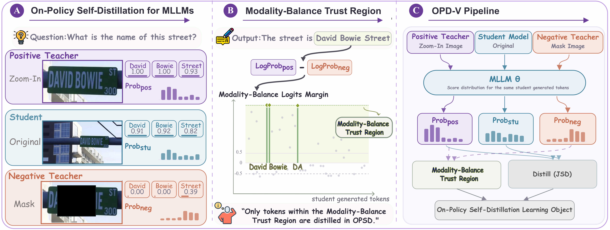

# OPD-V

<p align="center">
  <a href="https://github.com/aniri15/OPD-V"></a>
  <a href="https://arxiv.org/abs/2608.05131v2"></a>
  <a href="https://huggingface.co/aaniri/OPD-V-Qwen3.5-4B"></a>
  <a href="./LICENSE"></a>
</p>

OPD-V is a visual On-Policy Self-Distillation (OPSD) framework for improving multimodal reasoning under Modality Imbalance. Instead of relying on a single privileged teacher, OPD-V contrasts a Positive Teacher conditioned on a Zoom-In Image with a Negative Teacher conditioned on a Mask Image, and distills only the on-policy tokens selected by the resulting Modality-Balance Trust Region.

This repository contains the training code, data preparation utilities, evaluation scripts, and links to released model checkpoints for the paper:

> OPD-V: Visual On-Policy Self-Distillation with Modality Balance

## Highlights

- Plug-and-play visual OPSD training for multimodal large language models.
- Positive/Negative Teacher construction from Zoom-In and Mask Image conditions.
- Tokenwise Modality-Balance Logits Margin and Modality-Balance Trust Region for selective self-distillation.
- verl-based training stack with OPD-V rollout construction, checkpoint merging, serving, and evaluation scripts.
- Released checkpoints for Qwen3-VL and Qwen3.5 backbones.

## Released Resources

| Resource | Link |
| --- | --- |
| Source code | [OPD-V GitHub repository](https://github.com/aniri15/OPD-V) |
| Training launcher | [`scripts/run_opdv.sh`](scripts/run_opdv.sh) |
| Data preparation | [`scripts/prepare_data.py`](scripts/prepare_data.py) |
| Evaluation scripts | [`eval/run_eval.sh`](eval/run_eval.sh) |

### Released Checkpoints

| Backbone | Method | Hugging Face |
| --- | --- | --- |
| Qwen3-VL-8B-Instruct | OPD-V | [](https://huggingface.co/aaniri/OPD-V-Qwen3-VL-8B-Instruct) |
| Qwen3-VL-4B-Instruct | OPD-V | [](https://huggingface.co/aaniri/OPD-V-Qwen3-VL-4B-Instruct) |
| Qwen3.5-9B | OPD-V | [](https://huggingface.co/aaniri/OPD-V-Qwen3.5-9B) |
| Qwen3.5-4B | OPD-V | [](https://huggingface.co/aaniri/OPD-V-Qwen3.5-4B) |

## Overview

During training, the student receives the Original Image, the Positive Teacher receives the Zoom-In Image, and the Negative Teacher receives the Mask Image. Their tokenwise Modality-Balance Logits Margin defines the Modality-Balance Trust Region, where OPD-V applies Jensen--Shannon distillation from the Positive Teacher to the student.

<p align="center">
  
</p>

## Environment

```bash
conda create -n opd-v python=3.12
conda activate opd-v

pip install --upgrade pip
pip install --no-deps -r requirements.txt
pip install -e . --no-deps
pip install flash-attn --no-build-isolation
pip install causal-conv1d==1.6.1 --no-build-isolation
```

Useful environment variables:

```bash
export PYTHON=python3
export HF_CACHE_ROOT=./cache/huggingface
export DATA_DIR=./cache/opd-v
export OPDV_WORK_DIR=./cache/opd-v
export WANDB_MODE=offline
```

`DATA_DIR/train.parquet` is the training file. Checkpoints, rollouts, and W&B logs are written under `OPDV_WORK_DIR`.

## Data

The default example below uses the public Vision-OPD-6K dataset.

```bash
${PYTHON} scripts/prepare_data.py \
  --data-dir ./cache/opd-v \
  --hf-repo yuanqianhao/Vision-OPD-6K
```

This creates `./cache/opd-v/train.parquet` and downloads the image data used by the parquet file.

## Train

Default OPD-V training:

```bash
CUDA_VISIBLE_DEVICES=0,1,2,3 \
PYTHON=python3 \
HF_CACHE_ROOT=./cache/huggingface \
DATA_DIR=./cache/opd-v \
OPDV_WORK_DIR=./cache/opd-v \
WANDB_MODE=offline \
bash scripts/run_opdv.sh
```

Use a local model path or a Hugging Face model id:

```bash
CUDA_VISIBLE_DEVICES=0,1,2,3 \
PYTHON=python3 \
MODEL_PATH=Qwen/Qwen3.5-4B \
MODEL_NAME=Qwen3.5-4B \
HF_CACHE_ROOT=./cache/huggingface \
DATA_DIR=./cache/opd-v \
OPDV_WORK_DIR=./cache/opd-v \
WANDB_MODE=offline \
bash scripts/run_opdv.sh
```

For Qwen3.5 models, use `Qwen/Qwen3.5-4B` with `Qwen3.5-4B`, or replace both fields with `Qwen/Qwen3.5-9B` and `Qwen3.5-9B`:

```bash
CUDA_VISIBLE_DEVICES=0,1,2,3 \
PYTHON=python3 \
MODEL_PATH=Qwen/Qwen3.5-4B \
MODEL_NAME=Qwen3.5-4B \
HF_CACHE_ROOT=./cache/huggingface \
DATA_DIR=./cache/opd-v \
OPDV_WORK_DIR=./cache/opd-v \
WANDB_MODE=offline \
bash scripts/run_opdv.sh
```

For Qwen3-VL Instruct models, use `Qwen/Qwen3-VL-4B-Instruct` with `Qwen3-VL-4B-Instruct`, or replace both fields with `Qwen/Qwen3-VL-8B-Instruct` and `Qwen3-VL-8B-Instruct`:

```bash
CUDA_VISIBLE_DEVICES=0,1,2,3 \
PYTHON=python3 \
MODEL_PATH=Qwen/Qwen3-VL-4B-Instruct \
MODEL_NAME=Qwen3-VL-4B-Instruct \
HF_CACHE_ROOT=./cache/huggingface \
DATA_DIR=./cache/opd-v \
OPDV_WORK_DIR=./cache/opd-v \
WANDB_MODE=offline \
bash scripts/run_opdv.sh \
  actor_rollout_ref.model.custom_chat_template_file=null
```

Save checkpoints every 10 update steps:

```bash
bash scripts/run_opdv.sh trainer.save_freq=10
```

Run on one GPU:

```bash
CUDA_VISIBLE_DEVICES=0 \
PYTHON=python3 \
bash scripts/run_opdv.sh \
  trainer.n_gpus_per_node=1 \
  data.train_batch_size=8 \
  actor_rollout_ref.actor.ppo_mini_batch_size=8 \
  actor_rollout_ref.rollout.n=2 \
  actor_rollout_ref.actor.ppo_max_token_len_per_gpu=9216 \
  actor_rollout_ref.rollout.max_model_len=9216 \
  actor_rollout_ref.rollout.max_num_batched_tokens=9216
```

## Method Options

By default, training uses OPD-V self-distillation with a cropped/box-image positive teacher, a random-mask negative teacher, JSD-style token distillation, and multiple on-policy student responses per prompt.

### Standard OPD-V

Positive teacher input: cropped/box image from `bbox_images`. Negative teacher input: a random-mask perturbation of the positive teacher image.

```bash
bash scripts/run_opdv.sh
```

### Extra Positive Teacher Image

Positive teacher input: student image plus repeated copies of the same student image.

```bash
bash scripts/run_opdv.sh \
  actor_rollout_ref.actor.self_distillation.teacher_extra_student_image_blocks=1
```

### OPSD Answer Hint

Positive teacher input: normal image and answer-hint text prompt.

```bash
bash scripts/run_opdv.sh \
  actor_rollout_ref.actor.self_distillation.teacher_prompt_mode=answer_hint
```

### Modality-Balance Trust Region

The Positive Teacher supplies the distillation target, while the Negative Teacher supplies the paired comparison for the same student-generated tokens. Positive Modality-Balance Logits Margins define the Modality-Balance Trust Region.

Random-mask negative teacher:

```bash
bash scripts/run_opdv.sh \
  actor_rollout_ref.actor.self_distillation.contrastive_visual_advantage=True \
  actor_rollout_ref.actor.self_distillation.contrastive_negative_mode=random-mask
```

Patch-based mask negative teacher:

```bash
bash scripts/run_opdv.sh \
  actor_rollout_ref.actor.self_distillation.contrastive_visual_advantage=True \
  actor_rollout_ref.actor.self_distillation.contrastive_negative_mode=patch-based-mask \
  actor_rollout_ref.actor.self_distillation.contrastive_patch_mask_ratio=0.3 \
  actor_rollout_ref.actor.self_distillation.contrastive_patch_size=14
```

Post-encoder visual-token drop:

```bash
bash scripts/run_opdv.sh \
  actor_rollout_ref.actor.self_distillation.contrastive_visual_advantage=True \
  actor_rollout_ref.actor.self_distillation.contrastive_negative_mode=post-encoder-token-drop \
  actor_rollout_ref.actor.self_distillation.post_encoder_visual_token_drop_rate=0.3
```

Input visual-token deletion:

```bash
bash scripts/run_opdv.sh \
  actor_rollout_ref.actor.self_distillation.contrastive_visual_advantage=True \
  actor_rollout_ref.actor.self_distillation.contrastive_negative_mode=input-visual-token-drop \
  actor_rollout_ref.actor.self_distillation.input_visual_token_drop_rate=0.3 \
  actor_rollout_ref.model.use_remove_padding=False
```

Negative modes:

| Mode | Visual condition |
| --- | --- |
| `no-image` | Remove image input |
| `full-blur` | Fully blur image before image processor |
| `random-blur` | Randomly blur image regions |
| `random-mask` | Randomly mask image regions |
| `patch-based-mask` | Black out raw image patches before image processor |
| `post-encoder-token-drop` | Zero visual representations after vision encoder |
| `input-visual-token-drop` | Delete visual token positions before the LLM |

### Loss Type

```bash
# Forward KL
bash scripts/run_opdv.sh actor_rollout_ref.actor.self_distillation.alpha=0.0

# Reverse KL
bash scripts/run_opdv.sh actor_rollout_ref.actor.self_distillation.alpha=1.0

# JSD-style midpoint
bash scripts/run_opdv.sh actor_rollout_ref.actor.self_distillation.alpha=0.5
```

## Analysis Dumps

Dump per-token Modality-Balance Logits Margin analysis:

```bash
bash scripts/run_opdv.sh \
  data.train_max_samples=1000 \
  actor_rollout_ref.actor.self_distillation.contrastive_visual_advantage=True \
  actor_rollout_ref.actor.self_distillation.contrastive_negative_mode=random-mask \
  actor_rollout_ref.actor.self_distillation.analysis_dump_dir=./analysis/random_mask
```

Dump student/teacher log-probs:

```bash
bash scripts/run_opdv.sh \
  actor_rollout_ref.actor.self_distillation.log_prob_dump_dir=./analysis/log_probs
```

## Merge Checkpoints

```bash
bash scripts/merge_checkpoint.sh ./cache/opd-v/checkpoints/<experiment>/global_step_130
```

The merged Hugging Face checkpoint is written back into the same `global_step_*` directory.

## Serve

```bash
vllm serve ./cache/opd-v/checkpoints/<experiment>/global_step_130 \
  --gpu-memory-utilization 0.85 \
  --tensor-parallel-size 4 \
  --served-model-name OPD-V \
  --trust-remote-code
```

## Evaluate

```bash
API_BASE=http://localhost:8000/v1/ \
PYTHON=python3 \
OPENAI_MODEL_ID=OPD-V \
JUDGE_API_BASE=<judge-api-base> \
JUDGE_MODEL=<judge-model-name> \
BENCHMARK=vstar,zoombench,hrbench-4k,hrbench-8k,mme-realworld,mme-realworld-cn \
EVAL_DATA_DIR=./cache/opd-v/data \
OUT_DIR=./cache/opd-v/data/model_answer \
JUDGE_DIR=./cache/opd-v/data/judge \
bash eval/run_eval.sh
```

Evaluate one benchmark:

```bash
API_BASE=http://localhost:8000/v1/ \
PYTHON=python3 \
OPENAI_MODEL_ID=OPD-V \
JUDGE_API_BASE=<judge-api-base> \
JUDGE_MODEL=<judge-model-name> \
BENCHMARK=zoombench \
EVAL_DATA_DIR=./cache/opd-v/data \
bash eval/run_eval.sh
```

Supported benchmarks:

```text
vstar, zoombench, hrbench-4k, hrbench-8k, mme-realworld, mme-realworld-cn
```

For Qwen3.5 baseline evaluation, use `Qwen3.5-4B`, or replace it with `Qwen3.5-9B`, matching the served model name:

```bash
API_BASE=http://localhost:8000/v1/ \
PYTHON=python3 \
OPENAI_MODEL_ID=Qwen3.5-4B \
ENABLE_THINKING=False \
JUDGE_API_BASE=<judge-api-base> \
JUDGE_MODEL=<judge-model-name> \
BENCHMARK=vstar,zoombench,hrbench-4k,hrbench-8k,mme-realworld,mme-realworld-cn \
bash eval/run_eval.sh
```

For Qwen3-VL baseline evaluation, use `Qwen3-VL-4B-Instruct`, or replace it with `Qwen3-VL-8B-Instruct`, matching the served model name:

```bash
API_BASE=http://localhost:8000/v1/ \
PYTHON=python3 \
OPENAI_MODEL_ID=Qwen3-VL-4B-Instruct \
ENABLE_THINKING=False \
JUDGE_API_BASE=<judge-api-base> \
JUDGE_MODEL=<judge-model-name> \
BENCHMARK=vstar,zoombench,hrbench-4k,hrbench-8k,mme-realworld,mme-realworld-cn \
bash eval/run_eval.sh
```

## W&B

Offline runs:

```bash
wandb sync ./cache/opd-v/wandb_logs/wandb/offline-run-*
```

Posthoc upload from rollout files:

```bash
${PYTHON} scripts/upload_training_to_wandb.py \
  --job-root ./cache/opd-v/job_<jobid> \
  --project opd-v \
  --experiment-name <run-name> \
  --job-id <jobid> \
  --wandb-mode offline
```

## Citation

```bibtex
@misc{opdv2026,
  title={OPD-V: Visual On-Policy Self-Distillation with Modality Balance},
  author={Aniri and Jinhe Bi and Peng Liao and Zengjie Jin and Volker Tresp and Fei Shen and Yunpu Ma and Tat-Seng Chua},
  year={2026}
}
```

## License

Apache-2.0
